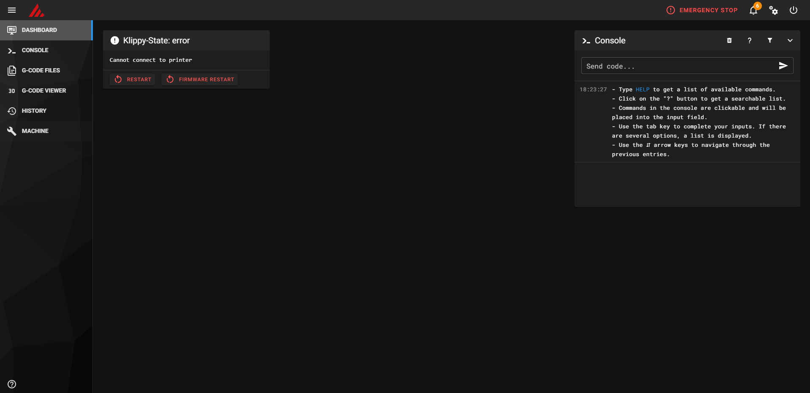

# Installation

## Installation with MarlinrakerOS

If you are planning to use Marlinraker on a Raspberry Pi, you can use
the prebuilt [MarlinrakerOS](https://github.com/pauhull/marlinrakeros) image.
It includes everything you need to run Marlinraker and is the easiest way
to get started.

First, download the latest MarlinrakerOS release from
[GitHub](https://github.com/pauhull/MarlinrakerOS/releases/tag/0.1.2)
and place the zip file on your computer. Next, download and install 
the [Raspberry Pi Imager](https://www.raspberrypi.com/software/).
After installing and opening it, you should see following window:

    { width="500" }

Click on "Choose OS", scroll down to "Use custom" and select the
zip file you just downloaded.

Next, click on the settings button in the bottom right. There you
can choose a hostname under which Marlinraker will be reachable
and a password for your machine.

Finally, connect your SD card to your computer, click on "Choose storage"
and select it. Click on "Write" to write the image to your SD card. After
writing is finished, you can unplug your SD card from your computer and
insert it into your Raspberry Pi. Congratulations, you successfully installed
Marlinraker!

Now type in the hostname you entered in Raspberry Pi Imager into your browser.
For example, if your hostname is `my-printer`, you should go to `http://my-printer/`.
Now you should see the default Mainsail interface Marlinraker ships with. 

From here you can make all adjustments you need, you don't have to SSH into your
Raspberry Pi. **Make sure to update Marlinraker, your web interface and system
packages to the latest version under the "Machine" tab.**

After [configuring](configuration.md) Marlinraker and connecting your
printer to the Raspberry Pi with USB you are good to go. 
Happy printing!

## Manual installation

!!! warning

    Manual installation is only recommended for advanced users. This section doesn't
    include a definitive tutorial on how to manually install Marlinraker, it just
    roughly explains the steps you need to do to get Marlinraker working.

1. Marlinraker needs [Node.js](https://nodejs.org/) to run. Make sure to have at 
least Node.js 16 installed.
2. [Download](https://github.com/pauhull/marlinraker/releases/latest) the latest
release of Marlinraker and unzip it to your desired location. Note that the
`marlinraker_files` directory will be located next to the directory the files
are unzipped to.
3. Set up a system service that runs Marlinraker with `npm run start` in your 
Marlinraker directory. See [here](https://github.com/pauhull/MarlinrakerOS/blob/master/src/modules/marlinraker/filesystem/etc/systemd/system/marlinraker.service)
for an example.
4. Set up a web server that serves the `marlinraker_files/www` directory and forwards
the API endpoints to the port that Marlinraker runs on (`7125` by default). See
[here](https://github.com/pauhull/MarlinrakerOS/blob/master/src/modules/nginx/filesystem/etc/nginx/nginx.conf)
for an example using Nginx.
5. Create [update scripts](advanced/update_manager.md) to make use of Marlinraker's 
integrated update manager. See [here](https://github.com/pauhull/MarlinrakerOS/tree/master/src/modules/marlinraker/filesystem/home/pi/marlinraker_files/update_scripts)
for examples. If Marlinraker is running on linux, make sure your user has sudo
rights and is not password prompted for when using sudo.