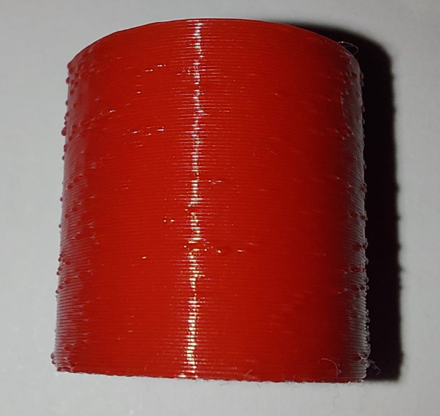

# Stuttering and Blobs

## Identifying stuttering

When printing with Marlinraker, it is possible that you may
notice small blobs and zits on printed walls, especially
on curved surfaces or corners. They might look something
like this:

{ width="400" }

There are many reasons for these blobs to occur. One of these
reasons is stuttering. Stuttering happens when the printer can't
keep up with G-code sent to it and the toolhead has to pause before
new commands come in. If you see your toolhead not moving smoothly
in curved sections you very likely have this issue. Try printing
a test object like a cylinder once with Marlinraker and once from
a USB stick or SD card. If the blobs on your print were caused by
stuttering it should have gone away when using an external storage
device.

## How to fix stuttering

### Marlinraker settings

Firstly, make sure to always keep Marlinraker up to date for the latest
bugfixes and performance improvements.

Some Marlinraker settings can negatively impact print performance
and thus cause stuttering. Check these settings in your configuration
to make sure you get the best performance:

```toml
# marlinraker.toml

[misc]
# ...
extended_logs = false
report_velocity = false
```

``extended_logs`` logs every line of G-code sent to the printer in
a text file. This negatively impacts print performance. Disable this
option if it is enabled.

``report_velocity`` sends M114 G-codes in very short time intervals
to compute toolhead velocity and extruder velocity. Some firmwares
pause after receiving a M114 command which causes stuttering, so try
disabling this option too.

Also, try choosing as high of a baud rate as possible. The higher the
baud rate, the more throughput the serial port has. Ideally, set
``baud_rate`` to ``"auto"``.

### Arc Welder

Most modern slicers create curved perimeters by dividing them into a
bunch of smaller straight line moves. This results in a lot of
unnecessary commands having to be sent to the printer by the host.
[Arc Welder](https://github.com/FormerLurker/ArcWelderLib) aims to
mitigate this issue by replacing these straight line segments with
arcs. This does not only significantly reduce file sizes, but also
allows for a much lower serial throughput. If your printer supports
G2/G3 G-codes, try using this software. You can use it with Marlinraker
by adding it as a post-processing script.

### Marlin configuration

If you have access to Marlin's ``Configuration.h`` and ``Configuration_adv.h``
files, you could try changing following settings:

#### Configuration.h

```
#define BAUDRATE 250000
```

Set the baud rate as high as possible to increase serial throughput.

#### Configuration_adv.h

```
#define BLOCK_BUFFER_SIZE 32
```

Increase the block buffer size so that more moves can be stored in the planner.

```
#define AUTO_REPORT_POSITION
```

Enable M154 G-code so that no M114 commands have to be sent to the printer.

### Marlinraker host

While printing, check the CPU usage of your host machine. This usually
shouldn't be a problem, but a low power SBC like an RPI zero can have
problems keeping up when there are other processes running, like a
system update for example.